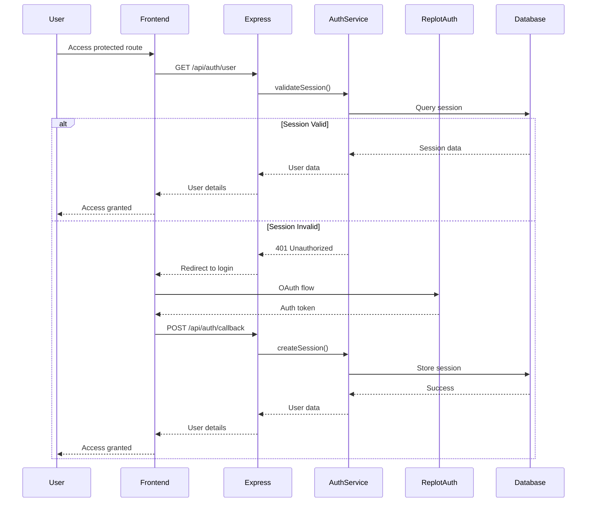
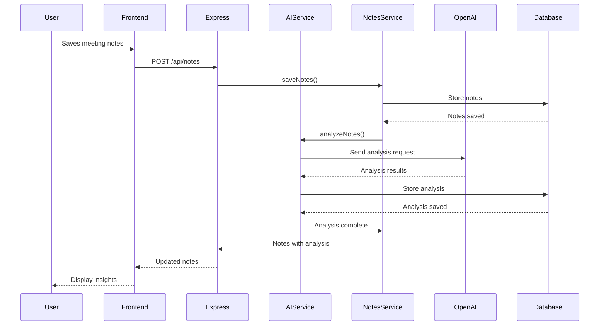
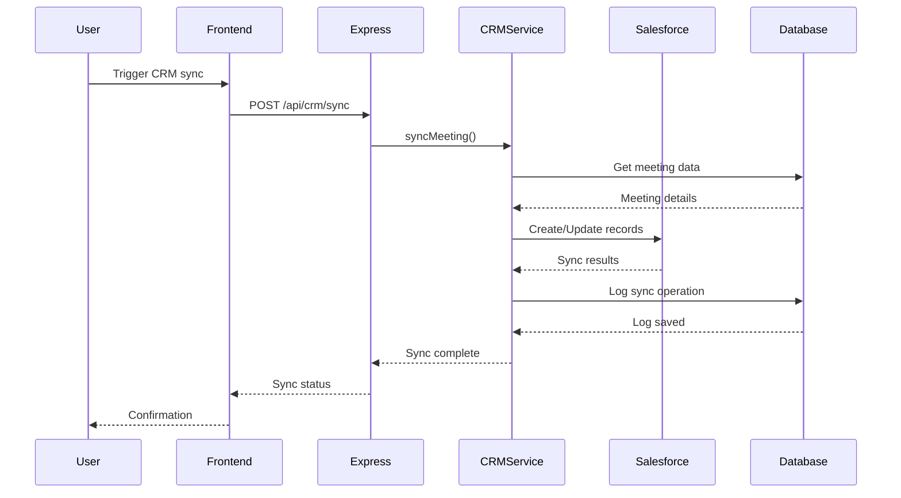

# Saprism System Architecture

## Overview
Saprism is a modern full-stack AI-powered sales coaching platform built with a hybrid development architecture, following SOLID principles and modern design patterns.

## High-Level Architecture Diagram

```mermaid
graph TB
    subgraph "Client Layer"
        WEB[Web Browser]
        MOBILE[Mobile Browser]
    end

    subgraph "Frontend (React + TypeScript)"
        REACT[React 18 App]
        VITE[Vite Dev Server]
        ROUTER[Wouter Router]
        
        subgraph "UI Components"
            PAGES[Pages]
            COMPONENTS[shadcn/ui Components]
            FORMS[React Hook Form]
        end
        
        subgraph "State Management"
            QUERY[TanStack Query]
            HOOKS[Custom Hooks]
        end
        
        subgraph "Rich Text Editor"
            TIPTAP[TipTap Editor]
            FORMATS[Text Formatting]
        end
    end

    subgraph "Backend (Node.js + Express)"
        EXPRESS[Express.js Server]
        VITEMW[Vite Middleware]
        
        subgraph "API Layer"
            AUTH_API[Authentication API]
            MEETINGS_API[Meetings API]
            NOTES_API[Notes API]
            AI_API[AI Analysis API]
            STATUS_API[System Status API]
        end
        
        subgraph "Service Layer (SOLID Architecture)"
            AUTH_SVC[Authentication Service]
            MEETINGS_SVC[Meetings Service]
            NOTES_SVC[Notes Service]
            AI_SVC[AI Service]
            CRM_SVC[CRM Service]
            CALL_SVC[Call Service]
        end
        
        subgraph "Repository Layer"
            USER_REPO[User Repository]
            MEETING_REPO[Meeting Repository]
            NOTES_REPO[Notes Repository]
            COACHING_REPO[Coaching Repository]
            CRM_REPO[CRM Sync Repository]
        end
        
        subgraph "Dependency Injection"
            CONTAINER[Service Container]
        end
    end

    subgraph "Database Layer"
        POSTGRES[(PostgreSQL Database)]
        PRISMA[Prisma ORM]
        
        subgraph "Database Tables"
            USERS_TBL[users]
            MEETINGS_TBL[meetings]
            NOTES_TBL[notes]
            COACHING_TBL[coaching_suggestions]
            SESSIONS_TBL[sessions]
            CRM_LOGS_TBL[crm_sync_logs]
        end
    end

    subgraph "External Services"
        OPENAI[OpenAI GPT-4o]
        SALESFORCE[Salesforce CRM]
        LIVEKIT[LiveKit WebRTC]
        REPLIT_AUTH[Replit OpenID Connect]
    end

    subgraph "Infrastructure"
        REPLIT[Replit Platform]
        NEON[Neon PostgreSQL]
        WS[WebSocket Server]
    end

    %% Connections
    WEB --> REACT
    MOBILE --> REACT
    
    REACT --> VITE
    VITE --> EXPRESS
    REACT --> QUERY
    REACT --> ROUTER
    REACT --> TIPTAP
    
    EXPRESS --> VITEMW
    EXPRESS --> AUTH_API
    EXPRESS --> MEETINGS_API
    EXPRESS --> NOTES_API
    EXPRESS --> AI_API
    EXPRESS --> STATUS_API
    
    AUTH_API --> AUTH_SVC
    MEETINGS_API --> MEETINGS_SVC
    NOTES_API --> NOTES_SVC
    AI_API --> AI_SVC
    
    AUTH_SVC --> USER_REPO
    MEETINGS_SVC --> MEETING_REPO
    NOTES_SVC --> NOTES_REPO
    AI_SVC --> COACHING_REPO
    CRM_SVC --> CRM_REPO
    
    CONTAINER --> AUTH_SVC
    CONTAINER --> MEETINGS_SVC
    CONTAINER --> NOTES_SVC
    CONTAINER --> AI_SVC
    CONTAINER --> CRM_SVC
    
    USER_REPO --> PRISMA
    MEETING_REPO --> PRISMA
    NOTES_REPO --> PRISMA
    COACHING_REPO --> PRISMA
    CRM_REPO --> PRISMA
    
    PRISMA --> POSTGRES
    POSTGRES --> USERS_TBL
    POSTGRES --> MEETINGS_TBL
    POSTGRES --> NOTES_TBL
    POSTGRES --> COACHING_TBL
    POSTGRES --> SESSIONS_TBL
    POSTGRES --> CRM_LOGS_TBL
    
    AI_SVC --> OPENAI
    CRM_SVC --> SALESFORCE
    CALL_SVC --> LIVEKIT
    AUTH_SVC --> REPLIT_AUTH
    
    EXPRESS --> WS
    
    REPLIT --> EXPRESS
    NEON --> POSTGRES

    %% Styling
    classDef frontend fill:#e1f5fe
    classDef backend fill:#f3e5f5
    classDef database fill:#e8f5e8
    classDef external fill:#fff3e0
    classDef infrastructure fill:#fce4ec
    
    class REACT,VITE,ROUTER,PAGES,COMPONENTS,FORMS,QUERY,HOOKS,TIPTAP,FORMATS frontend
    class EXPRESS,VITEMW,AUTH_API,MEETINGS_API,NOTES_API,AI_API,STATUS_API,AUTH_SVC,MEETINGS_SVC,NOTES_SVC,AI_SVC,CRM_SVC,CALL_SVC,USER_REPO,MEETING_REPO,NOTES_REPO,COACHING_REPO,CRM_REPO,CONTAINER backend
    class POSTGRES,PRISMA,USERS_TBL,MEETINGS_TBL,NOTES_TBL,COACHING_TBL,SESSIONS_TBL,CRM_LOGS_TBL database
    class OPENAI,SALESFORCE,LIVEKIT,REPLIT_AUTH external
    class REPLIT,NEON,WS infrastructure
```

## Data Flow

### 1. User Authentication Flow

### 2. AI Analysis Flow

### 3. CRM Synchronization Flow

### Infrastructure
- **PostgreSQL**: Primary database with ACID compliance
- **Neon**: Serverless PostgreSQL for cloud deployment
- **Replit**: Development and hosting platform
- **OpenID Connect**: Secure authentication protocol

## Security Architecture

### Authentication & Authorization
- **OpenID Connect**: Industry-standard authentication
- **Session Management**: Secure session storage in PostgreSQL
- **Route Protection**: Middleware-based route authorization
- **CSRF Protection**: Built-in Express security measures

### Data Security
- **Environment Variables**: Secure configuration management
- **API Key Management**: Encrypted storage of external service keys
- **Database Security**: Connection pooling and query parameterization
- **Input Validation**: Zod schema validation on all inputs

## Scalability Considerations

### Horizontal Scaling
- **Stateless Services**: All services designed to be stateless
- **Database Connection Pooling**: Efficient connection management
- **Caching Strategy**: TanStack Query for client-side caching
- **Load Balancing**: Ready for multi-instance deployment

### Performance Optimization
- **Code Splitting**: Vite-based dynamic imports
- **Database Indexing**: Optimized queries with proper indexes
- **API Response Caching**: Strategic caching of expensive operations
- **Asset Optimization**: Compressed and optimized static assets

## Deployment Architecture

### Development Environment
- **Docker Compose**: Complete local development stack
- **Hot Module Replacement**: Real-time development updates
- **Database Migrations**: Prisma-managed schema evolution
- **Environment Isolation**: Separate dev/staging/production configs

### Production Deployment
- **Single Port Strategy**: Simplified deployment architecture
- **Static Asset Serving**: Optimized file serving
- **Health Checks**: System status monitoring
- **Graceful Shutdown**: Proper connection cleanup
